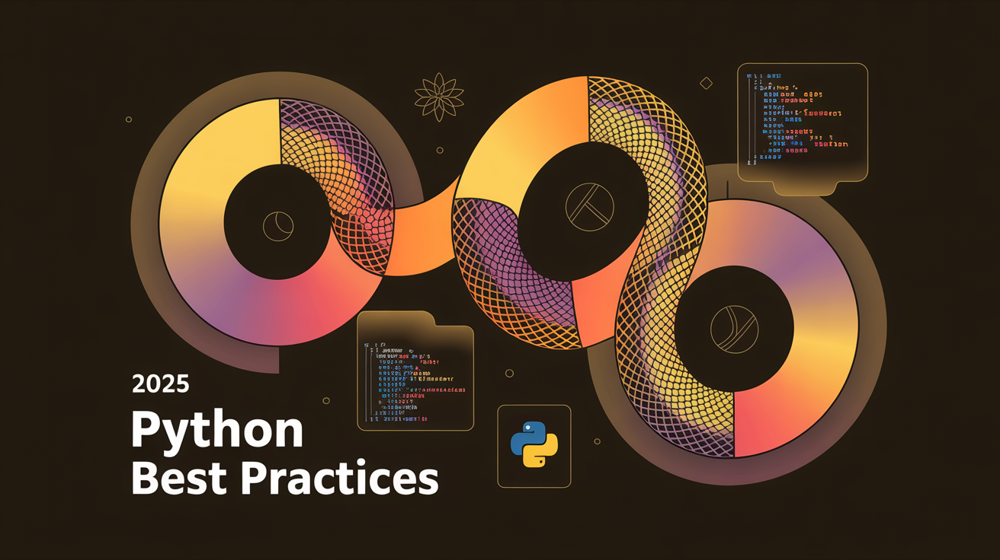

# 🐍 Python Best Practices 2025

Comprehensive guide to writing reliable, maintainable, and high-performance Python code.

---

## 🔍 Supported Python Versions

- ⚡️ **Python 3.14.0** (Oct 7, 2025) – Latest stable with official free-threaded builds, template strings, deferred annotations, and bundled `compression.zstd` module
- 🛡️ **Python 3.13.9** (latest bugfix on Oct 14, 2025) – Conservative choice with extended support through Oct 2029
- 📦 **Security-only**: 3.12 LTS receives fixes until Oct 2028; upgrade plans should target 3.13+

---

## 🚀 New & Experimental Features

- 🆓 **Free-Threaded CPython** (PEP 779) – official tier-2 builds enable real multi-core scaling  
- 🔤 **Template String Literals** (PEP 750) – safer templating for SQL, shell, and i18n use cases  
- 📝 **Deferred Annotations** (PEP 649) – annotation evaluation happens on demand for faster imports  
- 🧵 **Multiple Interpreters API** (PEP 734) – `concurrent.interpreters` brings low-overhead parallelism  
- 📦 **`compression.zstd` Module** (PEP 784) – native Zstandard support across stdlib tools  
- 🔥 **JIT & REPL Enhancements** – experimental JIT binaries ship for macOS/Windows; REPL ships with colorized output and smarter hints  

---

## 📁 Repository Structure

```
01-CORE-PRINCIPLES/      # PEP guidelines, naming conventions, SOLID & design patterns  
02-LINTING-FORMATTING/   # Ruff, Black & MyPy configs + style guide  
03-TESTING-FRAMEWORKS/   # pytest, unittest, coverage examples  
04-PROJECT-STRUCTURE/    # src layout, module vs. package best practices  
05-PERFORMANCE-SECURITY/ # Profiling tips, optimizations & security checks  
06-CI-CD-TEMPLATES/      # GitHub Actions, pre-commit hooks & YAML samples  
07-EXAMPLES/             # Data pipelines, FastAPI demos, real-world code  
output/                  # Generated docs, reports, artifacts  
```

---

## 🛠️ Essential Tools & Setup

### Toolchain

- 🔍 **Linter & Formatter**: [Ruff 0.14.3](https://github.com/astral-sh/ruff) – bundles linting, formatting, and rule sets  
- 🎨 **Formatter**: Ruff format (or [Black 25.9.0](https://github.com/psf/black) for parity with legacy pipelines)  
- 🔢 **Type Checking**: [MyPy 1.18.2](http://mypy-lang.org/) or [Pyright](https://github.com/microsoft/pyright) depending on ecosystem  
- 🧪 **Testing**: [pytest](https://docs.pytest.org/) + [pytest-cov](https://github.com/pytest-dev/pytest-cov) for coverage  
- 📦 **Package Manager**: [uv 0.9.7](https://github.com/astral-sh/uv) for fast, secure dependency workflows; [Poetry](https://python-poetry.org/) remains a solid alternative  

### Installation

```powershell
# Install core development tools with pip
pip install "ruff>=0.14.3" "black>=25.9.0" "mypy>=1.18.2" pytest pytest-cov

# Or using uv (recommended for speed and lockfiles)
uv tool upgrade "uv>=0.9.7"
uv add --dev ruff>=0.14.3 black>=25.9.0 mypy>=1.18.2 pytest pytest-cov

# Optional security & automation
pip install pre-commit bandit safety
```

### Pre-Commit Hooks

Create a `.pre-commit-config.yaml`:

```yaml
repos:
  - repo: https://github.com/astral-sh/ruff-pre-commit
    rev: v0.14.3
    hooks:
      - id: ruff-check
        args: [--fix]
      - id: ruff-format

  - repo: https://github.com/psf/black
    rev: 25.9.0
    hooks:
      - id: black

  - repo: https://github.com/pre-commit/mirrors-mypy
    rev: v1.18.2
    hooks:
      - id: mypy
```

Enable by running:

```bash
pre-commit install
```

---

## 📖 Learning Path

1. **01-CORE-PRINCIPLES** – PEP standards, naming, SOLID & design patterns  
2. **02-LINTING-FORMATTING** – Configure and enforce lint & format rules  
3. **03-TESTING-FRAMEWORKS** – Write robust tests & measure coverage  
4. **04-PROJECT-STRUCTURE** – Organize code for maintainability  
5. **05-PERFORMANCE-SECURITY** – Profile, optimize, and secure applications  
6. **06-CI-CD-TEMPLATES** – Automate linting, testing & deployment pipelines  
7. **07-EXAMPLES** – Explore real-world scripts and template projects  

---

## 🧩 Examples & Templates

- **data-science-pipeline.py** – ETL workflow with logging, error handling & tests  
- **fastapi-app.py** – Minimal FastAPI service with Pydantic models & security checks  

---

## 🎯 Quick Commands Reference

```bash
# Linting & Formatting
ruff check .                    # Fast linting
ruff format .                   # Fast formatting
black .                         # Alternative formatting
mypy .                          # Type checking

# Testing
pytest                          # Run all tests
pytest --cov=src               # With coverage
pytest -x -vs                  # Stop on first failure, verbose

# Security
bandit -r src/                  # Security scan
safety check                   # Dependency vulnerabilities

# Project setup
ruff init                       # Initialize ruff config
pre-commit install             # Setup git hooks
```

---

## ⭐ Contributing

Contributions are welcome! Please read [CONTRIBUTING.md](CONTRIBUTING.md) and follow our code style guidelines.  

---

## 📄 License

This project is licensed under MIT. See [LICENSE](LICENSE) for details.
